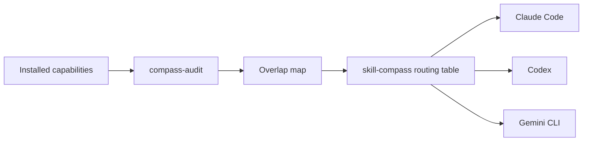

# skill-compass

<p align="center">
  <strong>Capability routing for coding agents</strong><br>
  Audit installed skills, resolve overlaps, and route tasks consistently across Claude, Codex, Gemini, and future agent harnesses.
</p>

<p align="center">
  
  
  
  
</p>

A meta-aware capability router for coding agents.

Power users accumulate skills, plugins, custom commands, subagents, MCP servers, and built-ins across several agent harnesses. The agent often knows each capability exists, but routes inconsistently when several overlap. skill-compass fixes that with three portable pieces:

- **Capability audit** - scans what is actually installed for a harness, groups overlaps by job, and generates a personalized routing table.
- **Router skill** - a small `skill-compass` instruction file that answers "what should I use for this?" and resolves ambiguous capability matches.
- **Compact always-on context** - a short routing summary that can be injected at session start or loaded as harness memory, so the priority rules are available before skill matching.

The core idea is harness-neutral: routing is a context problem, not an intelligence problem. Claude, Codex, Gemini, and future agents can all use the same audit model with thin adapter manifests.



## Install

### Claude Code

```bash
claude plugin marketplace add slindelow/skill-compass
claude plugin install skill-compass@skill-compass
```

Restart Claude Code, then say:

```text
audit my skills
```

### Codex

```bash
codex plugin marketplace add slindelow/skill-compass
codex plugin add skill-compass@skill-compass
```

Start a new Codex thread, then say:

```text
Use skill-compass to audit this harness and build my routing table.
```

### Gemini CLI

```bash
gemini extensions install https://github.com/slindelow/skill-compass
```

Restart Gemini CLI, then say:

```text
audit my skills
```

Verify with:

```bash
gemini extensions list
```

### Local Development

```bash
git clone https://github.com/slindelow/skill-compass.git
cd skill-compass
```

Claude:

```bash
claude plugin marketplace add .
claude plugin install skill-compass@skill-compass
```

Codex:

```bash
codex plugin marketplace add .
codex plugin add skill-compass@skill-compass
```

Gemini:

```bash
gemini extensions link .
```

## Repo Layout

```text
skill-compass/
├── .claude-plugin/plugin.json       # Claude Code plugin manifest
├── .claude-plugin/marketplace.json  # Claude marketplace manifest
├── .codex-plugin/plugin.json        # Codex plugin manifest
├── .agents/plugins/marketplace.json # Codex marketplace manifest
├── gemini-extension.json            # Gemini CLI extension manifest
├── GEMINI.md                        # Gemini always-loaded compact context
├── skills/
│   ├── skill-compass/SKILL.md       # generated routing table template
│   └── compass-audit/SKILL.md       # audit workflow
├── hooks/
│   ├── hooks.json                   # Claude SessionStart hook
│   └── session-start.sh             # inject compact routing + drift notice
├── routing/COMPACT.md               # compact routing summary
└── bin/fingerprint.sh               # harness-aware drift fingerprint helper
```

## Harness Support

### Claude Code

Claude is the most complete adapter today.

- Skills load from `skills/*/SKILL.md`.
- `.claude-plugin/plugin.json` provides plugin metadata.
- `hooks/hooks.json` runs `hooks/session-start.sh` on session start.
- The hook injects `routing/COMPACT.md` and warns when installed Claude skills/plugins drift from the last audited baseline.

After installing, say:

```text
audit my skills
```

### Codex

Codex uses `.codex-plugin/plugin.json` plus the shared `skills/` directory. The current adapter exposes the audit and router skills. Codex does not use the Claude SessionStart hook, so the compact routing table is available through the `skill-compass` skill rather than automatically injected by this repo.

After installing, ask Codex:

```text
Use skill-compass to audit this harness and build my routing table.
```

### Gemini CLI

Gemini uses `gemini-extension.json`.

- `GEMINI.md` loads the compact routing context.
- `skills/*/SKILL.md` provides the audit and router workflows.
- Gemini can be tested locally with `gemini extensions link .`.

After installing or linking, restart Gemini CLI and ask:

```text
audit my skills
```

## Public Release Checklist

1. Replace the generated example routing table with a fresh template or a user-generated table.
2. Keep generated `AUDIT-*.md` files local unless the user explicitly wants to publish an example inventory.
3. Validate each manifest with its native harness:
   - Claude: `claude plugin validate .`
   - Codex: validate `.codex-plugin/plugin.json` with the Codex plugin validator.
   - Gemini: `gemini extensions link .`, then restart and confirm `/extensions list`.
4. Run `bin/fingerprint.sh --harness claude`, `--harness codex`, and `--harness gemini` on machines that have those harnesses installed.
5. Tag releases semantically. Bump every manifest version together.

## Maintenance

Rerun `compass-audit` after installing, removing, enabling, or disabling agent capabilities. The audit should rewrite:

- `skills/skill-compass/SKILL.md`
- `routing/COMPACT.md`
- optionally `AUDIT-<date>.md`

For Claude, stamp the drift baseline after a successful audit:

```bash
bin/fingerprint.sh --harness claude --write
```
